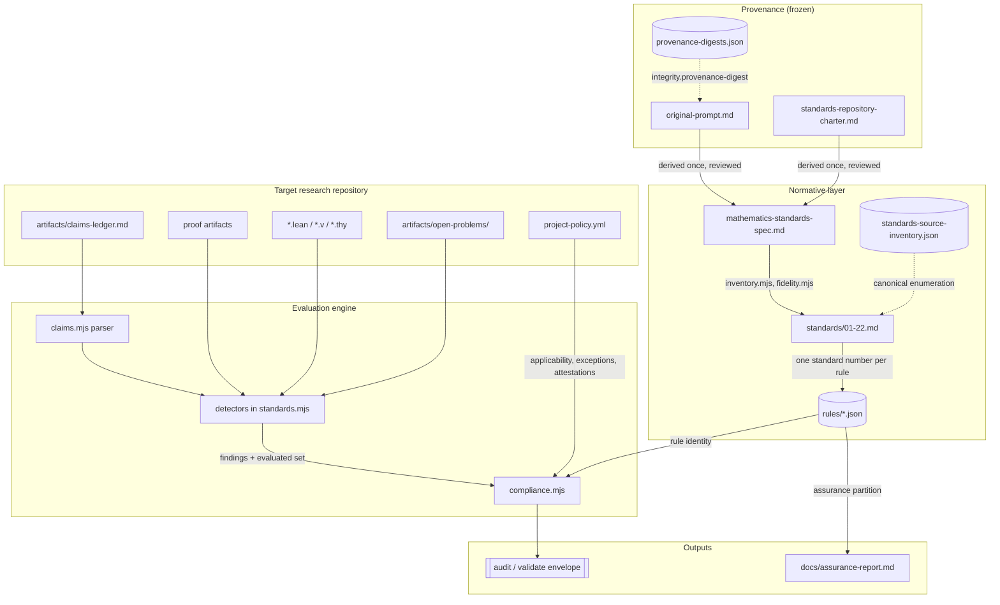
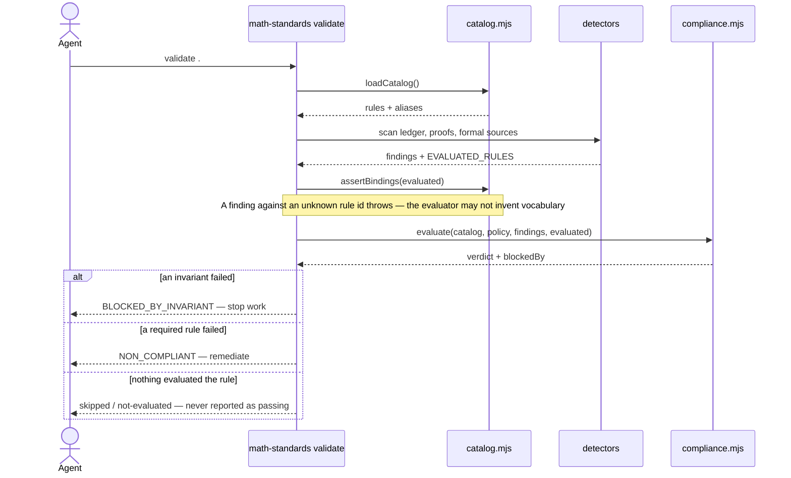

# Architecture — Mathematics Standards

> A standalone, independently maintained standards repository for mathematical reasoning, proof, and
> theorem work. It exists to stop mathematical research — particularly AI-assisted research — from
> confusing exploration, computation, reformulation, numerical evidence, or plausibility with proof.
> It is not a document collection: it is a policy-as-code system that determines what must be done,
> what must never be done, when a standard applies, what evidence demonstrates compliance, how that
> compliance is verified, and when a previous determination must be revisited. Its users are
> mathematicians and, far more often, AI research agents working on their behalf.

**Provenance markers.** Files marked *vendored* were copied unchanged from a reference standards
toolchain and are maintained here; files marked *adapted* were copied and changed, with the change
described. Nothing links to another repository at run time, build time, or test time — the charter
requires independence, and ADR 0005 records why vendoring was chosen over sharing and what it costs.

## Tech Stack

| Layer | Technology |
| --- | --- |
| Runtime | Node.js ≥ 18, ES modules (`"type": "module"`) |
| Dependencies | **None.** Not a preference — a structural guarantee. CI has no install step, so a dependency cannot be added without the workflow failing to run the code that needs it |
| Parsers | Hand-rolled and vendored: `yaml.mjs` (strict YAML subset, never coerces scalars), `jsonschema.mjs` (throws on unsupported keywords rather than ignoring them), `claims.mjs` (the claims-ledger grammar) |
| Tests | `node:test`, run as `node --test "test/*.test.mjs"` |
| Normative content | Markdown (`standards/*.md`), no frontmatter |
| Machine rules | JSON (`rules/*.json`), auto-discovered |
| Project configuration | YAML (`project-policy.yml`), validated against `schemas/project-policy.schema.json` |
| Diagrams | Mermaid `.mmd` canonical, embedded verbatim in Markdown, drift-checked without a Mermaid toolchain |
| Independence | No runtime, build, or test reference to any other standards repository. The shared machinery was **vendored** — copied in — not linked |

## Runtime Processes

There is no server, no daemon, and no scheduled job. This repository is a **command-line evaluator
plus a body of normative text**; everything runs to completion and exits with a meaningful code.
Sections of the standard architecture template that assume a service (hosting, ports, background
workers, external integrations) are omitted because they do not apply.

### The `math-standards` CLI

**Entry point:** `scripts/standards.mjs` — the CLI skeleton is vendored; every detector in it is this
repository's own.
**Exit-code contract:** `0` clean, `1` findings, `2` invocation or configuration error. The third is
load-bearing: a malformed policy is an error condition, never a compliance failure, because reporting
a broken configuration as non-compliant is a false red for the project and a false green for the tool.

| Command | Status | Purpose |
| --- | --- | --- |
| `audit <dir>` | adapted | Evidence discovery. Runs every detector and reports findings with evidence labels. Does not compute a verdict |
| `validate <dir>` | adapted | Verdict. Loads the catalog and the project policy, binds findings to rules, and produces the compliance envelope |
| `check <dir>` | alias | Documented alias of `validate`. The charter names `check`; the framework already distinguishes discovery from verdict, so aliasing is honest and a second implementation would not be |
| `explain <rule-id or standard-number>` | new | Prints a rule's metadata, its standard, its `$assuranceNote`, and its disposition under the current policy — the machine answer to "why does this apply to me?" |
| `status <dir>` | new | One-screen summary: verdict, framework coverage, counts by result state, blocking invariants |
| `init <dir>` | adapted | Writes the templates a project needs. Its `plan()`/`apply()` split is the dry-run contract: the dry run enumerates exactly the files the apply writes, because both derive from the same plan object |

`plan` is deliberately **not** a separate command. The charter lists it as a candidate; in this domain
the only mutation is `init`, and its existing dry-run mode already satisfies the requirement.
Reasoning is recorded in [design/cli.md](../design/cli.md).

## Supporting scripts

Each is a standalone gate, run individually in CI so a failure names itself.

| Script | Status | What it establishes |
| --- | --- | --- |
| `scripts/inventory.mjs` | vendored unchanged | The standards series has not silently changed shape. Extracts numbered items from the derived spec and compares them against the human-reviewed `artifacts/standards-source-inventory.json`. Fails on a missing number, a duplicate, a title mismatch, a broken `implementedBy` path, **or a file in `standards/` that no inventory entry claims**. Never regenerated from a run |
| `scripts/fidelity.mjs` | one-line adaptation | Every block a standard claims is verbatim source actually is. Whitespace is normalised; backticks, punctuation, and wording are not — those are what it exists to catch |
| `scripts/policy.mjs` | adapted | A project's `project-policy.yml` is well-formed, uses canonical rule ids, and contains no expired exception, no exception on a non-exemptible rule, and no rule declared both not-applicable and excepted |
| `scripts/diagrams.mjs` | vendored unchanged | Every `.mmd` appears verbatim as a fenced block in some document, and any committed `.svg` records the hash of the source it came from. Compares text, not pictures, which is what lets a zero-dependency repository enforce it at all |
| `scripts/catalog.mjs` | vendored unchanged | The rule catalog loads, every id is canonical `category.kebab-case`, no id is duplicated, and every mandatory field is present. `assertBindings` throws if the evaluator reports an id the catalog does not define |
| `scripts/compliance.mjs` | adapted | The verdict engine. See below |
| `scripts/claims.mjs` | new | The claims-ledger parser, the status rank map, and the inline-reference convention |
| `scripts/assurance.mjs` | new | Generates `docs/assurance-report.md` by partitioning the catalog on the `assurance` field, and computes framework coverage |

## The verdict engine

`scripts/compliance.mjs` turns catalog + policy + findings into one of five statuses. Four are
inherited from the reference framework; the fifth is specific to this repository.

| Verdict | When |
| --- | --- |
| `COMPLIANT` | Every applicable, evaluated rule passed |
| `COMPLIANT_WITH_EXCEPTIONS` | As above, with one or more active, unexpired exceptions |
| `NON_COMPLIANT` | A required rule failed |
| `NOT_EVALUATED` | The project declares no policy |
| `BLOCKED_BY_INVARIANT` | An observed violation of a rule the catalog declares both `forbidden` and `nonExemptible` |

Three properties are load-bearing and each is a specific defence:

1. **Status is computed from rules, never from the score.** There is no percentage at which
   compliance is granted.
2. **A rule nothing evaluated is `skipped`, never `passed`.** A `manual-review` rule lands there even
   when the evaluator examined it and found nothing, because "no automated finding" is not evidence
   for a requirement whose evaluator is a human. The dual matters just as much and was missing until
   a test caught it: an observation is not nothing either, so a `manual-review` rule with an actual
   finding against it *fails* rather than being skipped. Discarding it would report "nobody looked"
   about something that was looked at, and for an invariant it silently produced `COMPLIANT`.
3. **`BLOCKED_BY_INVARIANT` outranks `NON_COMPLIANT` and nothing clears it.** An exception against a
   non-exemptible rule is *rejected* rather than honoured; an attestation that contradicts an observed
   finding *fails* rather than overriding it; and both of those results carry the `invariant` flag, so
   neither route downgrades the verdict. The distinction matters in this domain: a missing
   counterexample search makes a project non-compliant and work may reasonably continue, whereas
   claiming a theorem is machine-checked while its dependency chain contains a `sorry` is an integrity
   failure that must stop the workflow. `isInvariant(rule)` is the single definition of the
   conjunction, so the catalog, the verdict, and the documentation cannot disagree.

The envelope carries `blockedBy` — the naming of which invariants stopped the run — so a consumer can
branch on the array without parsing the status string.

## The provenance and derivation chain

This is the part of the architecture most specific to a standards repository, and it is what makes
[Standard 21](../standards/21-standards-integrity.md) mechanically enforceable rather than
aspirational.

| Artifact | Role |
| --- | --- |
| `artifacts/prompt/original-prompt.md` | The mathematical requirements, unmodified. Source of standards 1–20 |
| `artifacts/prompt/standards-repository-charter.md` | The repository-design requirements, unmodified. Source of standards 21–22 |
| `artifacts/provenance-digests.json` | SHA-256 of both, recorded once. Line endings are normalised before hashing so a Windows checkout and a Linux checkout agree |
| `artifacts/prompts/mathematics-standards-spec.md` | The **derived** numbered spec. Neither source is a numbered series, and the inventory check needs one. The numbering, the titles, and the traceability table are authored; every block beneath them is reproduced from a source |
| `artifacts/standards-source-inventory.json` | The canonical enumeration: 22 items, each mapped to its implementing file. Human-reviewed once, committed, never regenerated |

The chain closes a specific hole. Fidelity checks a standard against the spec, so the cheapest way to
make a standard true is to edit the spec — and fidelity would still pass, because the thing it
compares against is what moved. The digests are the fixed point that makes that edit fail CI.

## Normative layer

`standards/NN-<kebab-title>.md`, zero-padded, no gaps, no frontmatter. Every document carries the
same sections: an opening paragraph naming the failure it prevents, a `Source: item N` line, then
`## Scope`, `## Requirements` (as `### R1 — Title`), `## Additions this standard makes beyond the
source`, `## Relationship to other standards`, and `## Implementation` — which states plainly what
the tooling does *not* establish.

All twenty-two are written. `scripts/inventory.mjs` fails if any file in `standards/` is not
claimed by the reviewed inventory, or if the inventory and the derived spec disagree, so the series
cannot change shape without the change being deliberate.

## The claims ledger

The mathematics-specific data structure, and the reason the detectors in this repository can say
anything at all. It is a Markdown file in the *target* project (default
`artifacts/claims-ledger.md`) recording every claim as a heading plus a field list: `Status`,
`Statement`, `Domain`, `Quantifiers`, `Assumptions`, `Depends`, `Obligations`, `Equivalences`,
`Evidence`, `Formal`, and `History`. Identifiers are `CLM-NNNN` and are never reused.

What that buys is an **epistemic audit trail**: a per-claim record of what is asserted, what it rests
on, what evidence supports it, and every status transition with its date and reason. Silent
promotion, circular dependency, conditional-as-unconditional, numerics-as-proof, and difficulty
displacement all become tractable against it — not because the parser understands mathematics, but
because the ledger makes the claim structure explicit enough to check for internal contradiction.

The status vocabulary is the fifteen tokens of
[Standard 2](../standards/02-claim-hierarchy.md), and it is deliberately separate from the **epistemic
rank map** the detectors use. The source's list is not a strength ladder:
`EQUIVALENT_REFORMULATION` is lateral, `COMPUTATIONAL_VERIFICATION` is an evidence state,
`UNRESOLVED_CLAIM` sits outside the ladder entirely, and `CONDITIONAL_THEOREM` is weaker than
`THEOREM` despite being listed after it. Treating the listed order as a ranking would produce
confidently wrong automated reasoning, so the vocabulary is preserved verbatim and the ranking is
declared separately and defended in that standard's `## Additions` section.

## Detector families

| Family | Scans | Establishes |
| --- | --- | --- |
| `claims.*` | The ledger | Vocabulary conformance, history completeness, promotions unsupported by evidence or by dependencies, prose asserting a status above the ledger's |
| `rigor.*` | The ledger | Presence of domain, quantifier, and assumption declarations |
| `proof.*` | The ledger graph | Dangling dependencies, cycles (which is circular reasoning, including the variant routed through freshly minted lemmas), proved-rank claims with open obligations |
| `computation.*` | Ledger + verification scripts | Proved-rank claims whose only evidence is computational; universal statements supported by bounded checks; floating-point arithmetic behind an "exact" claim |
| `formal.*` | `*.lean`, `*.v`, `*.thy` | Placeholder tokens (`sorry`, `admit`, `Admitted`, `oops`), undisclosed `axiom` declarations, and the flagship rule: a `MACHINE_CHECKED_PROOF` claim whose cited artifact bears a placeholder |
| `problems.*`, `lifecycle.*` | `artifacts/open-problems/` | Required sections present and non-empty; terminated approaches carrying reopening evidence |
| `evidence.*` | The ledger | Evidence type vocabulary, artifact resolvability, equivalence direction |
| `integrity.*` | The repository itself | Provenance digests unchanged |

Two conventions keep the detectors from committing the error the standards prohibit:

- **Use versus mention.** Detectors scan comment- and string-stripped source. A Lean comment reading
  `-- TODO remove the sorry from Draft` must not fire, or the tool would be reporting a mention as a
  use — overstating its own finding, in a repository about not overstating findings. This requires
  extending the comment-syntax table with `.lean` (`--`, `/- -/`) and `.v` / `.thy` (`(* *)`), and a
  `.v` file is treated as Coq only when it also contains Coq structure, since `.v` is equally Verilog.
- **Observed versus inferred.** A finding read directly from a file or a ledger row is `OBSERVED`. A
  finding produced by a phrase heuristic — "proved … numerically", a quantifier guessed from prose —
  is `INFERRED`, always. Regex scanning cannot execute a proof-assistant kernel, trace a Lean
  dependency graph, or judge mathematical equivalence, and every rule declares which side of that
  line it falls on through its `assurance` field and its `$assuranceNote`.

## Data Flow

The end-to-end path from a mathematical statement to a verdict:

1. A researcher or agent states a claim and registers it in the target project's
   `artifacts/claims-ledger.md` with a status from the fifteen-token vocabulary.
2. `math-standards validate .` locates the repository root and reads `project-policy.yml`. A malformed
   policy stops here with exit 2 — never a compliance verdict.
3. `loadCatalog()` reads every `rules/*.json`, rejecting a non-canonical id, a duplicate, or a missing
   mandatory field. A catalog that loaded partially would silently shrink the denominator every score
   is computed over, so it throws instead.
4. `claims.mjs` parses the ledger into entries, malformed entries, and a dependency graph.
5. The detectors run over the ledger, the proof artifacts, the proof-assistant sources, and the
   open-problem files, producing findings and — separately — the set of rule ids that were actually
   examined.
6. `assertBindings` checks every reported id against the catalog. A detector reporting an unknown id
   throws, because an evaluator that can invent vocabulary has become a second, private catalog.
7. `evaluate()` combines catalog, policy, findings, and the examined set: not-applicable
   classifications are honoured and shown, attestations are judged (contradiction first — a human
   saying a rule is satisfied does not change what a check observed), exceptions are applied or
   rejected, and everything unexamined lands on `skipped`.
8. The envelope is emitted with the verdict, the score, the assurance breakdown, `blockedBy`, and the
   framework-coverage figure — which sits outside the verdict on purpose and is never blended into it.

## Key Patterns & Conventions

- **The catalog owns identity, the policy owns applicability, the evaluator owns evidence, and none
  may redefine the others.** Enforced by `assertBindings` rather than by convention; without a
  mechanical check the evaluator grows a private copy of rule metadata within a week.
- **Canonical rule ids only.** `^[a-z][a-z0-9]*(\.[a-z0-9]+(-[a-z0-9]+)*)+$`. The category segment
  carries no hyphen. The `aliases` array exists in the schema and is empty everywhere in this
  repository, deliberately: the reference framework needed aliases to reconcile two spellings that had
  both been written, and the whole point of choosing one spelling on day one is never to need them.
- **The counted thing is derived, never asserted twice.** Framework coverage is computed from the
  catalog at build time rather than written into prose, because a hand-maintained count is a fact
  about someone's memory. The same applies to the number of detector-backed rules: the authority is
  the test asserting that `EVALUATED_RULES` and the detector set agree, not a number in a document.
- **Every guard traces to a real failure.** Speculative checks go stale and get deleted. The
  provenance digests, the whole-content diagram match, and the one-line fidelity claim sentence each
  exist because the corresponding defect actually occurred.
- **Honest absence.** A missing check is reported as missing. `not-evaluated`, `not-applicable`, and
  `blocked-by-invariant` are distinct outcomes precisely so that a clean run cannot be read as
  complete coverage.

## Diagrams

`docs/architecture.mmd` is canonical; the block below is its verbatim embedded copy, and
`scripts/diagrams.mjs` fails if they diverge.

`docs/verdict-flow.mmd`, embedded verbatim, is the primary flow including the paths a happy-path
diagram would omit:

No `.svg` renders are committed. This repository has no dependencies and CI has no install step, so
`@mermaid-js/mermaid-cli` cannot be run as part of the build; the `.mmd` sources and their embedded
copies are the deliverable, and `scripts/diagrams.mjs` enforces that they agree. This absence is
declared rather than papered over with a hand-drawn substitute.

## Entry Points for Common Tasks

| Task | Where to start |
| --- | --- |
| Add a standard | Add a numbered item to `artifacts/prompts/mathematics-standards-spec.md`, add its `{number, title, implementedBy}` row to `artifacts/standards-source-inventory.json`, bump `expectedCount`, then write `standards/NN-<kebab-title>.md`. `npm run inventory` fails until all three agree |
| Add a rule | Add the object to the matching `rules/<category>.json` with all mandatory fields, `aliases: []`, the three lifecycle fields present as `null`, and a `$assuranceNote` stating what the check does not establish. `npm run test` fails if the id is not canonical |
| Add a detector | Implement it in `scripts/standards.mjs`, add its rule id to `EVALUATED_RULES`, and add a fixture under `test/fixtures/` that asserts it both fires and does not fire. `assertBindings` throws if the rule is not in the catalog first |
| Change the claims-ledger grammar | `scripts/claims.mjs` and `standards/03-claims-ledger.md` change together, plus `templates/claims-ledger.md` |
| Change a diagram | Edit the `.mmd`, re-embed it verbatim in this file, run `npm run diagrams` |
| Adopt the standards in a research project | `npx math-standards init .`, then read `INSTRUCTIONS.md` |

## Known Gaps

- **The detectors will never establish mathematical correctness.** They check a ledger for internal
  consistency and scan text for tokens. Whether a proof is valid, whether a hidden assumption exists,
  whether a citation supports what it is cited for, and whether the central difficulty has merely
  moved are all `manual-review` with assurance `none`, satisfiable only by a recorded attestation
  whose digest goes stale when the reviewed files change. Roughly a third of the catalog sits there.
- **Everything mechanical operates on what is declared.** An assumption nobody wrote down, a claim
  nobody registered, or a ledger entry that does not describe the real mathematics is invisible to
  every check here.
- **Proof-assistant checking is a token scan, not a kernel run.** A clean `formal.placeholder-in-chain`
  is the absence of the obvious contradiction, not certification.
- **Suppression leaves no artifact.** A hidden counterexample or a deleted failed run cannot be
  detected by anything; Standard 18 makes deletion visible to a reviewer instead.
- **The integrity invariant is only partly mechanical.** Provenance digests, the inventory, fidelity,
  non-exemptible rejection, and the lifecycle trail make tampering loud. None of them stops a
  determined human with commit rights, and Standard 21 R5 says so rather than implying otherwise.
- **Vendoring has a cost.** A fix to the YAML parser here does not reach the sibling repositories it
  was copied from. Accepted in exchange for independence (ADR 0005).
- **No `.svg` renders are committed.** Zero dependencies means no Mermaid toolchain in CI; the
  `.mmd` sources and their embedded copies are the deliverable, and `scripts/diagrams.mjs` enforces
  that they agree.
